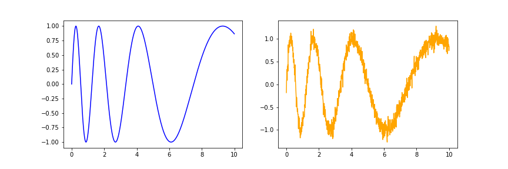
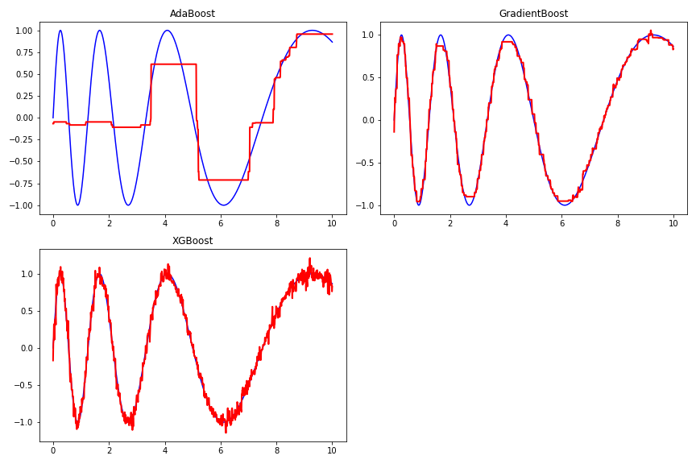
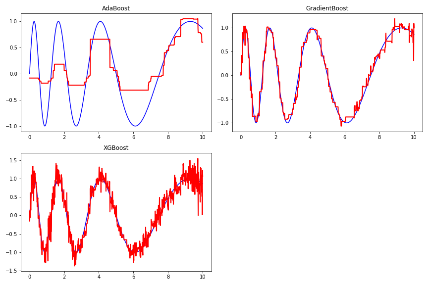

[](http://quantlet.de/)

## [](http://quantlet.de/) **Boost-sin** [](http://quantlet.de/)

```yaml

Name of QuantLet : 'Boost-sin'

Published in : 'BoostExamples' 

Description : 'An example of predicting sin(x) with changing frequency.'

Keywords : 'AdaBoost , Gradient Boost , XGBoost'

Author : 'WK Haerdle Zuo Xiaorui'

Submitted : Sun, Mar 17 2024
```









### [IPYNB Code: Boost-sin.ipynb](Boost-sin.ipynb)


automatically created on 2024-03-18