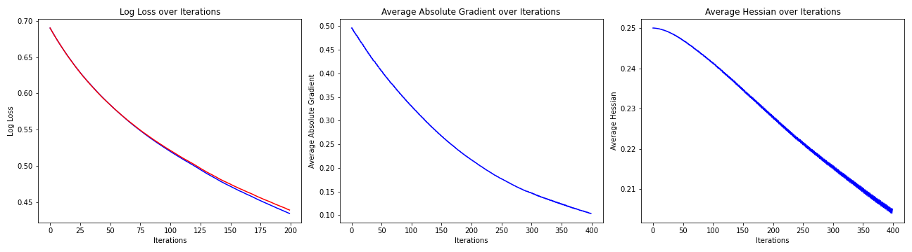

[](http://quantlet.de/)

## [](http://quantlet.de/) **ExampleG&H** [](http://quantlet.de/)

```yaml

Name of QuantLet : 'ExampleG&H'

Published in : 'BoostExamples' 

Description : 'Showing the Gradient and Hessian over time of training'

Keywords : 'XGBoost , Visualize'

Author : 'WK Haerdle Zuo Xiaorui'

Submitted : Tue, Mar 5 2024
```



### [IPYNB Code: ExampleG&H.ipynb](ExampleG&H.ipynb)


automatically created on 2024-03-06