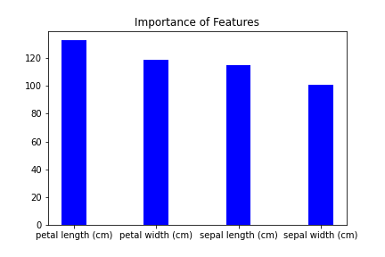
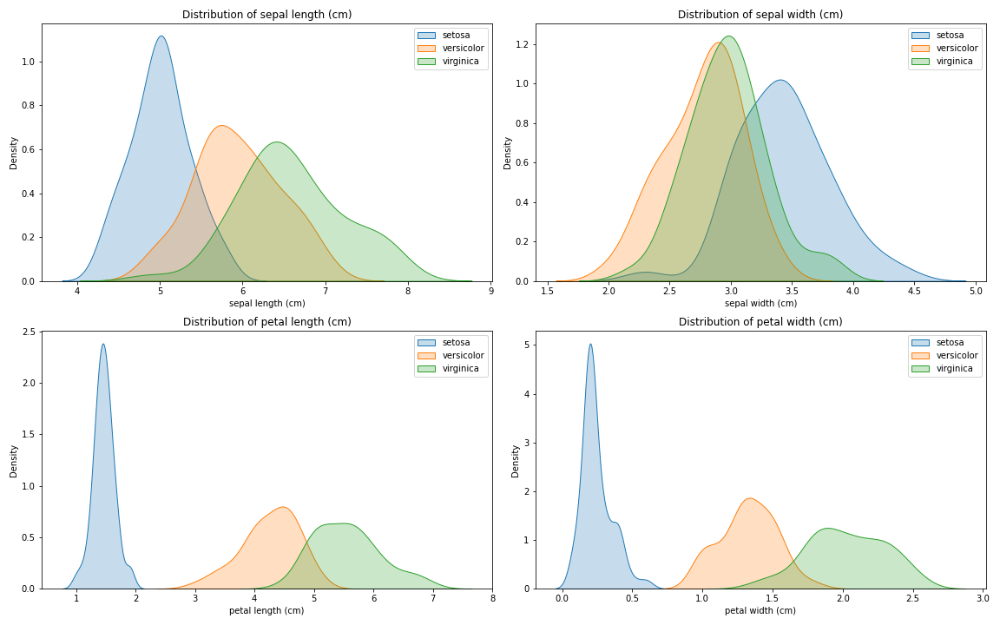
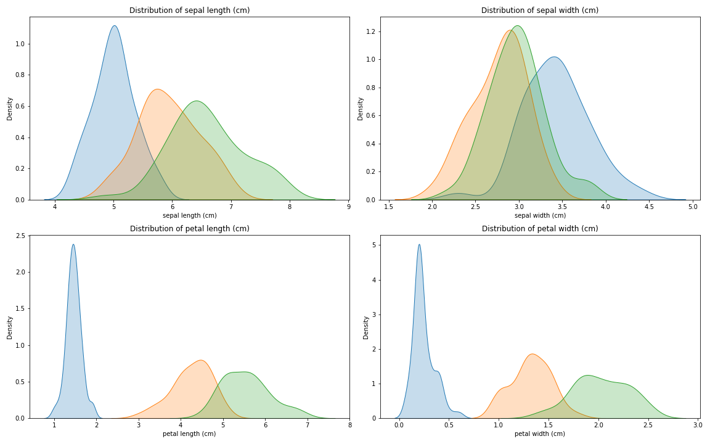
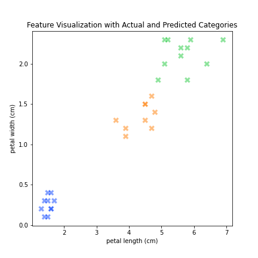

[](http://quantlet.de/)

## [](http://quantlet.de/) **XGBoost_Iris** [](http://quantlet.de/)

```yaml

Name of QuantLet : 'XGBoost_Iris'

Published in : 'BoostExamples' 

Description : 'An example clustering Iris with XGBoost'

Keywords : 'XGBoost , Iris'

Author : 'WK Haerdle Zuo Xiaorui'

Submitted : Tue, Mar 5 2024
```









### [IPYNB Code: XGBoost_Iris.ipynb](XGBoost_Iris.ipynb)


automatically created on 2024-03-06